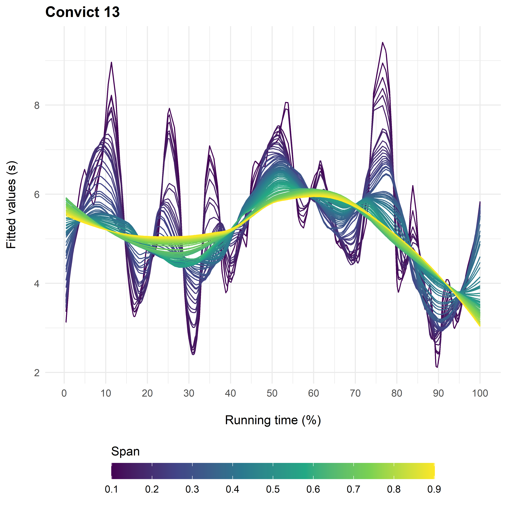
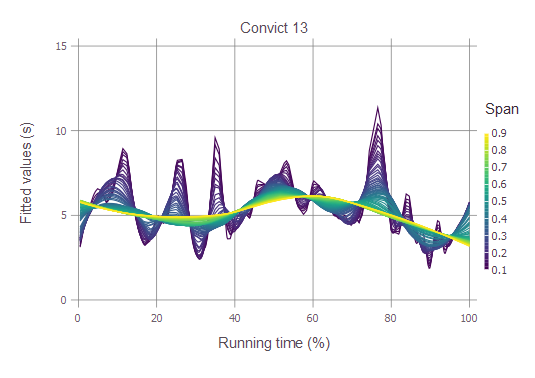

# Fitting multiple loess smoothers to motion picture shot length data
This repository has functions in a range of languages for fitting a set of LOESS smoothers to the shot length data of a motion picture, iterating over a range of spans specified by the user and plotting the result. 

LOESS, or [locally estimated scatterplot smoothing](https://en.wikipedia.org/wiki/Local_regression), is a nonparametric method for fitting a curve to an independent variable. Rather than fitting a global model, LOESS fits a linear or quadratic function, depending on the degree of the polynomial used, to a localised section of the data. The size of the segment of the data is determined by the span of the local window, with more data used in fitting the curve as the span increases. 

The functions available on this repository allow the analyst to identify the editing structure of a film at different scales by using different spans without committing the analyst to a particular level of smoothing before applying the function. At the macro-scale, LOESS smoothers with large spans describe the dominant trend in the editing of a film; while at the micro-scale smoothers with small spans reveal transient features associated with the editing of specific moments in a film.

The resulting plot can be used diagnostically for exploratory data analysis in order to decide which spans for the LOESS smoother are the most informative or for limiting the range of spans used for cross-validation to speed up the process of selecting the best span to describe the data.

Functions are available for the following languages: R and Julia (with others on the way!)

## R: loessggplot
The ```loessggplot``` function fits and visualises multiple loess smoothers using ```ggplot2```.

```loessggplot``` takes the following arguments:

- ```x```: a numeric vector of the lengths of shots in a film in temporal order.
- ```low```, ```high```, ```step```: ```low``` and ```high``` set the limits on the range of the spans of the LOESS smoothers, and ```step``` defines the increase in the value of the span for each iteration.
- ```title```: text added between "" is added to the plot as a title.
- ```ticks```: specifies the distance between tick marks on the colour bar in the legend. The lower and upper limits of the colour bar are set by ```low``` and ```high```, respectively.

To draw the plot using the shot length data for the Buster Keaton film *Convict 13* (1920) using data from the [Buster Keaton dataset](https://computationalfilmanalysis.wordpress.com/2020/07/07/keaton-data-set/), we use the command:

```R
loessggplot(convict_13, low = 0.1, high = 0.9, step = 0.01, title = "Convict 13", ticks = 0.1)
```
which returns the following plot:

<p align="center">

</p>
  
## Julia: MultiLoessPlot
The ```MultiLoessPlot``` function fits and visualises multiple loess smoothers using ```Gadfly```, to produce plots in a simialr style to ```gglpot2```.

```MultiLoessPlot``` takes the following arguments:

- ```df```: a data frame containing shot length data in wide format.
- ```index```: the index of the data frame column containing the shot length data to be visulaised.
- ```low```: the minimum loess span.
- ```step```: the increment of the span of the loess smoothers.
- ```high```: the maximum loess spans.
- ```title```: the title of the plot.

To plot the result for *Convict 13*, we load the csv file for the film and select the column containing the shot length data by its index. ```MultiLoessPlot``` will remove `NA` values and calculate shot timings:

```Julia
using CSV, DataFrames
df = CSV.read("./path/to/file/file.csv", DataFrame; header=1)
using ColorSchemes, Gadfly, Loess
MultiLoessPlot(df; index=2, low=0.1, step=0.01, high=0.9, title="Convict 13")
```

which returns the following plot:

<p align="center">

</p>
